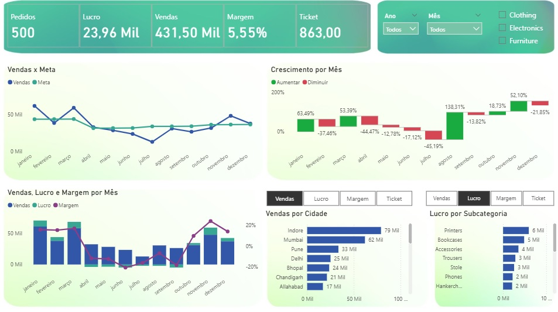
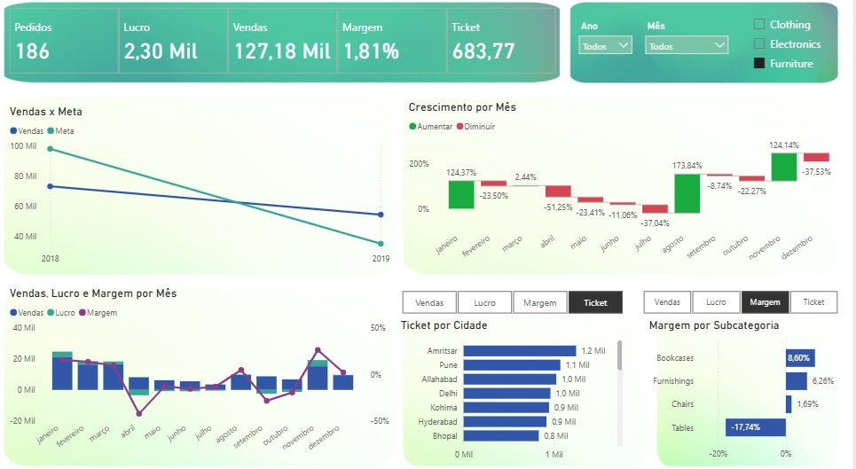

📊 **Projeto de Análise de Vendas com SQL e Power BI**  
Este repositório contém um projeto completo de análise de dados com foco em vendas, utilizando **SQL para modelagem e análise** e **Power BI para visualização interativa**.
  

🎯 **Objetivo do Projeto** 
Realizar uma análise estratégica sobre o desempenho de vendas de uma empresa fictícia.  
O objetivo é identificar padrões de comportamento, gargalos, oportunidades de crescimento e apresentar insights que ajudem a melhorar a performance comercial.
  

🧱 **Estrutura do Projeto** 
📁 arquivos/        # Base de dados bruta em CSV  
📁 scripts_sql/     # Scripts usados para limpeza, modelagem e análises  
📁 relatorios/      # Briefing, Relatório Técnico e Resumo Estratégico com os principais achados 
📁 power bi/        # Arquivo Power BI com o dashboard final
  

🔍 **Etapas Desenvolvidas** 
Entendimento do Problema 
Briefing inicial com metas e perguntas de negócio 
Preparação da Base de Dados 
Normalização da estrutura via SQL 
Limpeza de dados nulos, duplicados e inconsistentes 
Modelagem e Análise com SQL 
Uso de CTE, joins e funções de agregação 
Criação do Dashboard no Power BI 
Visualizações: evolução de vendas, performance geográfica e categoria de produtos 
Design focado em clareza e interpretação executiva 
Relatório executivo com insights e recomendações
  

🛠️ **Ferramentas Utilizadas** 
MySQL para estruturação e análise dos dados 
Power BI Desktop para construção do dashboard interativo 
LibreOffice/Excel para apoio na limpeza inicial
  

📈 **Principais Métricas Analisadas** 
Receita total, margem e lucro por período 
Meta x Realizado por mês 
Vendas por estado e categoria 
Performance por subcategoria e região 
Identificação de categorias campeãs e gargalos
  

📈 **Dashboard**  
  

